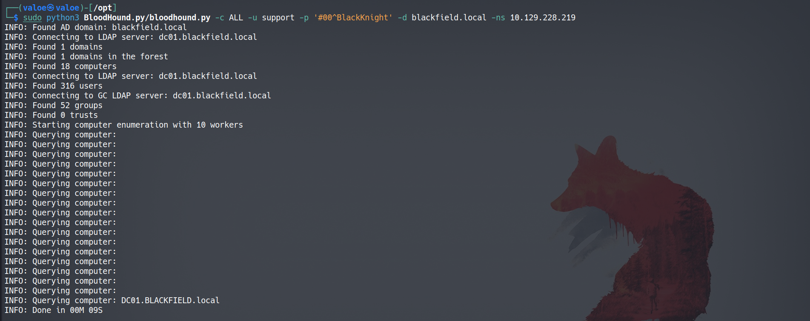
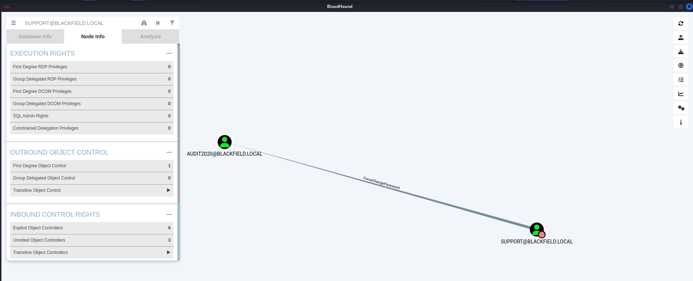
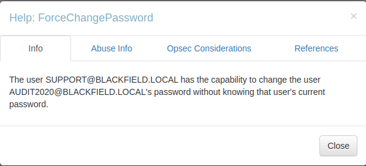
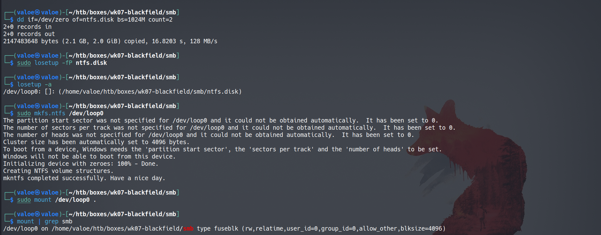

Name: Ben Roudebush

Lab: HTB - Blackfield

IP Address: 10.129.228.219

Date: 5 October 2022

## High-Level Summary

Blackfield is a fun box that showcases Windows Active Directory enumeration and exploitation. The box starts with AS-REP roasting to find the `support` user and then crack its password. Bloodhound is then used to discover that another account, `audit2020`, can have its password reset remotely. `audit2020` has access to memory dumps, including `lsass`. That yields a hash for another account, `svc_backup`, which can login through WinRM. The `svc_backup` account can create backups and this privilege can be used to copy the `ntds.dit` file, which contains all domain account password hashes, including the Administrator account. This can be used to log in through WinRM once again and own the box.

## Service Enumeration

### Nmap

Nmap shows several open ports. Notably, we have `DNS`, `Kerberos`, `LDAP`,  and`RPC`. `LDAP` especially suggests that this is a Windows Domain Controller. Unfortunately, I happened to be aware that this box *does* have the [Zerologon](https://github.com/SecuraBV/CVE-2020-1472) patch, so no easy wins there.

### SMB Enumeration

SMB not only gives us the domain: `BLACKFIELD.local`, but the anonymous account can log in and read the `profiles$` share.  Which contains many, many empty directories.

Even if they're empty, they are useful for generating a list of possible usernames. To do this, I'm going to mount the share and use `ls` to generate the list.

### User Enumeration

#### Kerbrute

Once I have the list, I'm going to use `kerbrute`'s `userenum` option to try all of the usernames and find valid ones. `kerbrute` is a great way to bruteforce usernames and passwords on Windows boxes that have it exposed because it's relatively less noisy and must faster than other bruteforce methods. 

`kerbrute` found three valid usernames: `audit2020`, `support`, and `svc_backup`. We'll use all three in this lab at some point, but first I want to find out if I can get any of these accounts' hashes. I want a plaintext list of these usernames, and instead of doing the sensible thing and just typing them by hand, I spent way too long learning how to use `awk`, which I wasn't that familiar with.

#### Impacket GetNPUsers

I then used the username list with `impacket`'s `GetNPUsers` module to get the hashes for any users without the pre-authentication requirement.

#### Hashcat

It looks like `support` doesn't have this flag set, so we get its hash. I can send that to `hashcat` with its new, convenient hash type auto-detection, which finds the mode number for me.

It cracks very quickly, even in a VM. (I know that's naughty!)

### Bloodhound Enumeration

`support` doesn't have access to any new interesting SMB shares.

I can list more users with `rpcclient` , maybe there are more users?

I spent more fun time with `awk` and cleaned up my working directory a little to produce a tidier list of usernames.

But none of these usernames, other than the three we already had, yielded anything. Next I wanted to use `bloodhound` to find interesting privesc paths. To use `bloodhound`, I first need a Bloodhound ingestor to generate the .JSON files that `bloodhound` can query. Luckily, [this](https://github.com/fox-it/BloodHound.py) one exists for Kali.

Then, I did some `chown` and `mv` to organize them and make sure they were owned by my user to avoid permission issues since I installed the ingestor with `root`.

Then, I need a `neo4j` server, so I start that.

Since this is the first time I've used `neo4j` on this machine, I need to go to `localhost:7474` to set a password.

Then, I started the Bloodhound GUI from the command line.

#### Remote Password Reset

If I find the support account using the search bar on the right and then go to "Node Info", I can see that `support` has a hit for "First Degree Object Control". I looks like `support` can reset `audit2020`'s account password using `RPC`.

If I use the `setuserinfo2` command, I can set `audit2020`'s password. The `23` option comes from [this](https://room362.com/post/2017/reset-ad-user-password-with-linux/) blog and the password must have a capital letter, a lowercase letter, and a special character but can be anything that fits those criteria. I used my username with an exclamation point.

### More SMB Enumeration

The `audit2020` account has read access to a new SMB share: `forensic`.

If I mount it, I can see what looks like the results of an audit, we have the results of commands, some memory dumps, and auditing tools.

## Initial Foothold

### Shell as `svc_backup`

#### PyPyKatz

The memory dumps contain `lsass`, which is where `mimikatz` gets its hashes from. I'll copy that to my working directory and run [`pypykatz`](https://github.com/skelsec/pypykatz), a python implementation of `mimikatz` against it. `pypykatz` was pretty reluctant to run on my machine, but I got it to work by installing manually instead of with `pip`.

Right at the top of the `pypykatz` dump is the NT hash for `svc_backup`.

Where the other accounts didn't have the permissions to log in via WinRM, `svc_backup` does. The user flag is in `C:\Users\svc_backup\Desktop`.

## Privilege Escalation

If I run `whoami /priv` to look at my privileges, I see that I have `SeBackupPrivilege`, which is essentially full system read. It's designed to allow this user to back up the system, but I can use it to "back up", read "copy", `ntds.dit`, which has the domain hashes in it, including `Administrator` on this box.

### Setup

This sounds rather simple, but there are a few things I need to do first. I set up a python SMB server to transfer the file off of the target.

If I try to use the `wbadmin` utility to back up the file, I can't because my SMB share has the wrong filesystem. `wbadmin` wants `NTFS/ReFS`, whereas my filesystem is `btrfs`.

To get around this, I'm going to create an `NTFS` file system partition and mount it to `~/htb/boxes/wk07-blackfield/smb`, which is where I'll be hosting the `SMB` server.

Now, I can't use the python-based SMB server because it won't work with the mounting and filesystem changes I've made, so I'll have to use the built-in Linux implementation. I just have to be sure to reset my configuration after I'm done as to not expose my VM. I'll add the following configuration options to my `/etc/samba/smb.conf` file.

Then I restart the `smbd` service to take into account the configuration changes.

### Backing Up the File

The backup takes forever, but it eventually finishes. Then, I need to get the version of this backup to a format I can read it. To do that I'll need the version number, which is just the date and time the file was created. I can check this by looking at the file on the target's filesystem thanks to SMB.

### Restore the Original Without ACL

Then I can use the `restore` operation to get the file in its original form.

Finally, I need both the recovered file and the system hive on my machine to get the account hashes, I copy both to my SMB share.

### Get the Administrator Hash -> shell as Administrator

Then, I used `impacket`'s `secretsdump` to get the administrator hash.

Then, I can use WinRM to log in and grab the root flag!

## Vulnerability Summary

- Inadequate account controls
	- `support` did not have the "require PREAUTH" flag set
	- `support` could remotely reset `audit2020`'s account password
- Insecure File Storage
	- `audit2020` had access to very sensitive files remotely through an SMB share
- Dangerous Privileges
	- `svc_backup` had the ability to backup and restore all files