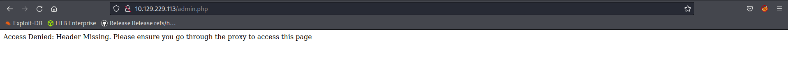

Name: Ben Roudebush

Lab: HTB - Control

IP Address: 10.129.229.113

Date: 24 October 2022

## High Level Summary

Control is a seemingly simple Windows web server, with the slightly unusual MySQL where one would expect MSSQL. The exploitation starts with discovering that I can forge an HTTP header and access the admin section of the site without credentials. Then, I probe a SQL injection vulnerability to obtain both file write and some user hashes. Using the file write, I can get a webshell on the box and use that to get a reverse shell back to my machine. One of the hashes I found from SQL can now be used to pivot to the `hector` account. This is where the box gets difficult. `Hector` is a very high-privileged user, and the path to `system` involves editing the registry keys associated with certain services. Doing this, I can edit the path of one of the services to point to `nc64.exe`, restart the service, and because services run as `system`, I own the box.

## Service Enumeration

### Nmap

Nmap shows three ports open:

- HTTP on port 80: running `IIS`, meaning this is a Windows box
- MSRPC on port 135: further cementing that this is Windows
- MySQL on port 3306: normally, you would expect MSSQL on 1433, given this is a Windows box. But this isn't *unheard-of*, just strange.

### Web Enumeration

The web page seems to be a very simple page for a tech company. Clicking on the `About` section also doesn't give me much. If I click on `Admin` instead of getting a login page like you'd expect, I instead get this error:

It's telling me I need to go through a proxy to access the page. On the source of the home page, there's a hint for what I need to do.

The SSL certificates are at `192.168.4.28`. I don't know what HTTP Header the page expects, but with `wfuzz` and this hint as to an IP address of the proxy, I can find it out.

As with all `wfuzz` commands in my guides, I've omitted the initial run of the command without the `--hh` flag. Normally, you'd run `wfuzz` once to see what the typical response looks like, and then hide that with the appropriate `--hx` flag. Anyway, hiding all 89 character responses, I can see that the server wants `X-Forwarded-For` set to the IP from above. I can use a Firefox extension to edit my HTTP headers for this URL.

When I reload the admin page, I get a product catalog instead of the error message.

## Initial Foothold

### SQL Injection

I want to play around with all of the different entry fields on this page, both because I saw MySQL open earlier, and because there's data being returned from a query. Both of these indicate that the page might be SQL-injectable. If I Pull up the request from searching for a product in Burp, I can mess with the query that's being run.

If I put a `'` at the end, I get an error. That means I can inject into this query.

If I try to pull in other data (here just test data), I get a cardinality error. Regular [vsauce](https://www.youtube.com/c/vsauce1) viewers, or those that can read error messages, will know this means that the set of data returned from the first query and my test query have a different number of columns.

I can pretty easily figure out how many columns it wants by counting the number of fields on the page: 

## Privilege Escalation

## Recommendations