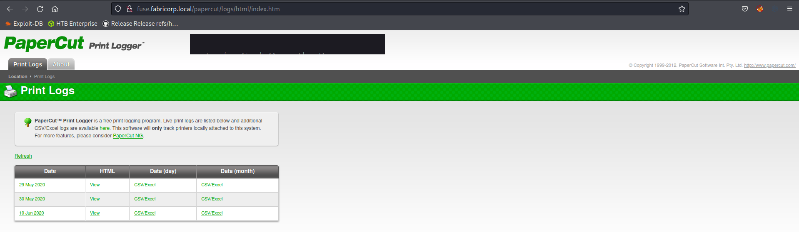
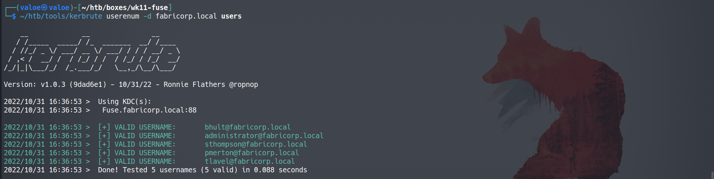
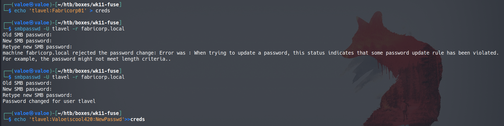

Name: Ben Roudebush

IP Address: 10.129.2.5

Date: 31 October 2022

## High Level Summary

Fuse was a Windows Domain Controller machine hosting a web print portal. Because the lab was released before 2020, it is vulnerable to [ZeroLogon (CVE-2020-1472)](https://www.secura.com/blog/zero-logon), but I've performed that attack many times in my other labs, so I'll leave it as an exercise to the reader. On said page, there are a number of usernames which, when combined with a wordlist generated by CeWL, finds an outdated credential pair. This outdated pair can be used to reset the account's password. Using RPC with the new password, credentials for a service account can be found. That service account can log in using WinRM, so a shell can be obtained. The service account has permissions to install device drivers, so a malicious driver can be compiled and installed on the device to spawn a shell as `SYSTEM`.

## Service Enumeration

### Nmap

Nmap indicates several ports and information about the machine:

- 53: DNS. Since this is a HTB lab, there's not likely to be anything interesting here. In the real world, this allows you to get a ton of useful information about an organization. If there were fewer other ports open, I'd take a look at this.
- 88: Kerberos. Along with a couple other ports, this means we're dealing with a Windows Domain Controller. If it's old, it's vulnerable to ZeroLogon, so always test that out.
- 135, 139: RPC & NetBIOS
- 389: LDAP. Another port that indicates that this is a domain controller. This leaks the domain name as well: `fabricorp.local`
- 445: SMB. There might be goodies for the taking over SMB file share.
- 464, 593, 636: Kpasswd, RPC over HTTP, and secure LDAP
- 1433: MSSQL. If we get credentials for it, we might be able to get user information or a shell from this. It might also be a hint that a web page is SQL-injectable.
- 3268 & 3269: More LDAP ports
- 8080: HTTP. There's a web page here too. Web pages often have a lot of different attack vectors, so this is very interesting.
- 49XXX ports: RPC ports

### Web Enumeration

Trying to go to `http://10.129.2.5` redirects to `fuse.fabricorp.local`, which my machine can't find.

I can edit my `/etc/resolv.conf` so that my machine uses the target for DNS (port 53 is open).

Once I've done this, I get a print logger on HTTP. Most of the page seems to be static content, with hard-coded pages, so no parameters to mess with.

There are a bunch of print jobs. I can't see what was printed, but I can see a bunch of usernames.

### Enumeration for Valid Credentials

I manually copied these to a file for use later.

I want to try to see if these usernames are all valid domain users, so I'll use Kerbrute, which I've used [before](./HTB-Blackfield.md).

All five are valid. In hindsight, I should have added a known-bogus username to verify that it's not just returning everything up. Here I use `cewl` to generate a wordlist for potential passwords. Then I can feed those two lists to `crackmapexec` to spray those credentials pairs.

I get `tlavel:Fabricorp01`, but it's status of `PASSWORD_MUST_CHANGE`, which means it was valid in the past, but now it's not. We can still use it though.

## Initial Foothold

### Password Reset to Enumerate More Users

Using `smbpasswd`, I can use the old password to reset this user's password. I had to do some trial-and-error to figure out the password rules. It turns out that there is a script that goes and sets the password back to `Fabricorp01` every minute or so. So every time I run a different command, I'm running this reset every time and incrementing the number by 1 due to password history.

There is a printer user, as expected from the print logging service.

Enumerating the printers yields a password from the description field. I have to use an IP for this command due to a bug in `rpcclient`. Using this password, I can see that the service user has WinRM access, which is pretty neat.

Evil-WinRM allows me to get a shell and the user flag.

## Privilege Escalation

### WinPEAS

I want to run winPEAS on the box to enumerate for privilege escalation vectors, so I host the binary out of my tools directory.

Then I download the binary on the target and run it.

WinPEAS doesn't mark it red, but under `Users`, I can see that I have the `SeLoadDriverPrivilege`. This means that this account can load and install device drivers. This is done likely for printer drivers, since this is a service account for the printer. But it does allow me to install malicious drivers which will give me root privileges.

### Capcom.sys, Malicious Device Drivers

I need a few files to execute this exploit. What's more, I need to compile a lot of them on Windows, so I'll need to build all the files I need and send them over to Linux. Here's a list of links to the files I'm using:

- [EoPLoadDriver](https://github.com/TarlogicSecurity/EoPLoadDriver/): Loads the malicious Capcom.sys into the installed drivers
- [Capcom.sys](https://github.com/FuzzySecurity/Capcom-Rootkit/blob/master/Driver/Capcom.sys): 
- 

## Recommendations

https://github.com/tandasat/ExploitCapcom