Name: Ben Roudebush

IP Address: 10.129.229.133

Date: 26 October 2022

## High Level Summary

Mantis is a Windows Domain Controller. Because the lab was released before 2020, it is vulnerable to [ZeroLogon (CVE-2020-1472)](https://www.secura.com/blog/zero-logon), but I've performed that attack many times in my other labs, so I'll leave it as an exercise to the reader. Anyway, the intended path involves finding the MSSQL credentials on a somewhat hidden webpage to gain access to the database. That database can then be examined to find low-level system user credentials. Using a relatively old exploit, we can use these credentials to create a privileged Kerberos ticket and get `SYSTEM` access.

## Service Enumeration

### Nmap

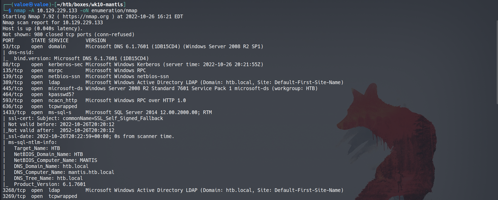
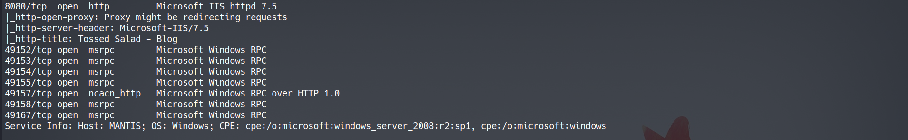

Nmap returns a ton of ports, I go over each and what information it tells us.

- 53: DNS. Since this is a HTB lab, there's not likely to be anything interesting here. In the real world, this allows you to get a ton of useful information about an organization. If there were fewer other ports open, I'd take a look at this.
- 88: Kerberos. Along with a couple other ports, this means we're dealing with a Windows Domain Controller. If it's old, it's vulnerable to ZeroLogon, so always test that out.
- 135, 139: RPC & NetBIOS
- 389: LDAP. Another port that indicates that this is a domain controller. This leaks the domain name as well: `htb.local`
- 445: SMB. There might be goodies for the taking over SMB file share.
- 464, 593, 636: Kpasswd, RPC over HTTP, and secure LDAP
- 1433: MSSQL. If we get credentials for it, we might be able to get user information or a shell from this. It might also be a hint that a web page is SQL-injectable.
- 3268 & 3269: More LDAP ports
- 8080: HTTP. There's a web page here too. Web pages often have a lot of different attack vectors, so this is very interesting.
- 49XXX ports: RPC ports

### Web Enumeration

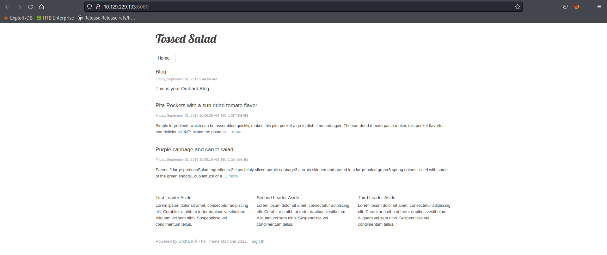

The site on 8080 is just a static blog page with some real text, but also contains "lorem ipsum", so probably not intended to do some kind of cEWL or find information here. I checked out SMB and anonymous login was not allowed. Most of the other ports aren't interesting without some kind of information on the box, so I decided to expand my search in terms of open ports.

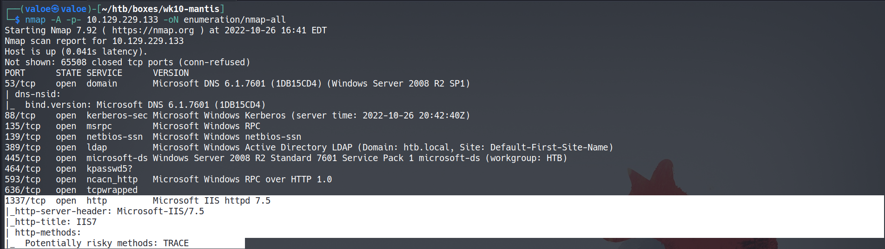

An all-ports scan returns port 1337 up as well. This is not a typical port to be open, but it looks like there is another webpage.

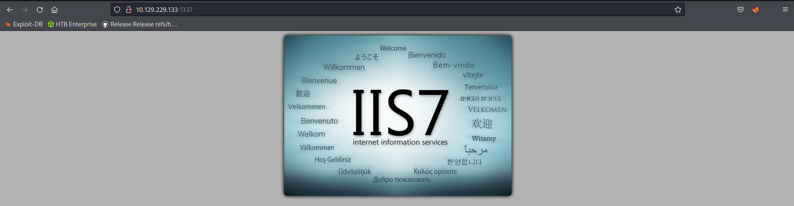

#### Gobuster

I had a `gobuster` scan running on the blog page, so I started one here too. After a few minutes, the one targeting this new 1337 page finds a directory.

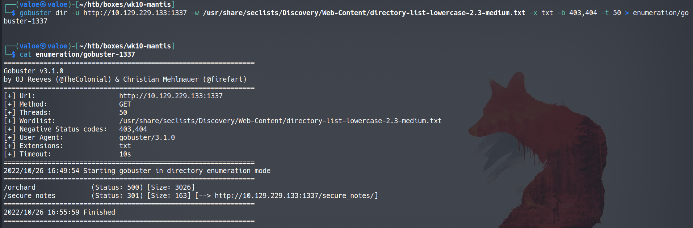

If I go to the directory, I get a listing:

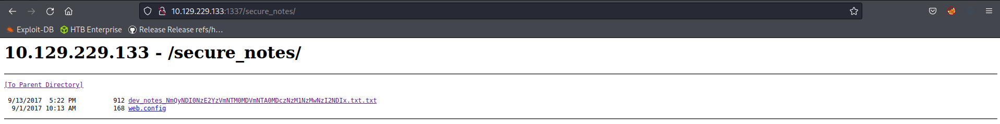

The `web.config` file link is broken, but the `dev_notes_...` file is very interesting.

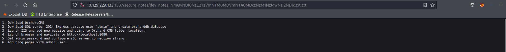
[After some scrolling...]
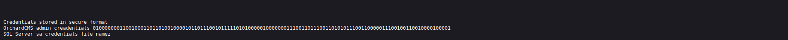

This tells me a ton of information. Firstly, I could decode that binary string and get admin access to Orchard CMS, but I actually couldn't find any exploits for the admin page. What's even more interesting though, is the fact that I have the MSSQL admin credentials: username: admin, password: whatever that string in the filename means.

### Decoding the Password

There's some trial-and-error involved here, but my first thought, since this is a HTB lab, was to base64 decode that string. I get a string of hex that's barely too long to be MD5, but I can run it through `xxd` to see if it's just ASCII. Turns out, yeah, it's just ASCII.

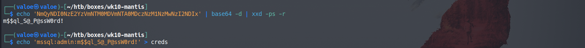

Cool! Now I have the MSSQL credentials: `admin:m$$ql_S@_P@ssW0rd!`.

## Initial Foothold

I tried using impacket's `MSSQLclient.py` here, but I was getting a weird error. Considering I used this about three weeks ago with no issues, it's probably just this lab being weird. Either way, I can use `dbeaver` for a GUI (I know, *barf*) MSSQL client instead. I created a new Microsoft SQL Server connection and filled in the details as such.

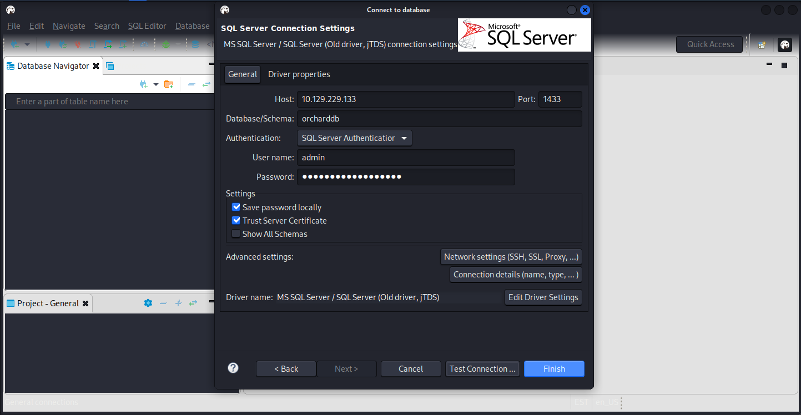

The first thing I looked for is `Users`, since this database is pretty huge. I immediately found this file, with James's user credentials in plain text.

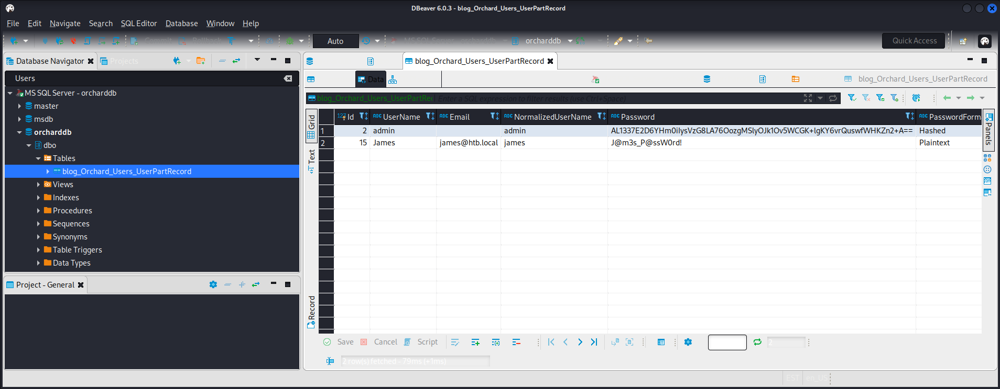

Looking at RPC and SMB, James is a pretty low-privilege user and doesn't have access to much. I could try to crack that admin hash, but I have no idea if:

1. I even can
2. It's for a system account
3. It isn't just the password I already have

## Privilege Escalation

### Kerberos Knock & Pass -> Shell as `SYSTEM`

Instead, since James doesn't look like he can do *anything*, it's time to look for Kerberos things. There's [this](https://wizard32.net/blog/knock-and-pass-kerberos-exploitation.html) fantastic guide on Kerberos Knock and Pass that I used to help me a lot with this box, so check it out! The first steps of the process involve setting up some configuration on my end.

#### `/etc/hosts`

I first need to tell my computer where the domain controller is. A lot of Kerberos features don't work with IP address but do work with domain name. So I put the four variations I could imagine being used into my `/etc/hosts` file under `10.129.229.133`, the IP of Mantis.

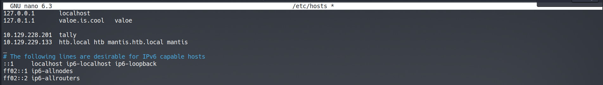

#### `/etc/resolv.conf`

I also make sure to tell my box to go to `10.129.229.133` for any DNS requests, in case I missed the actual domain name it wants.

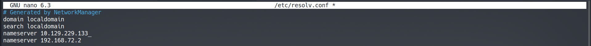

#### `/etc/krb5.conf`

I first moved my Kerberos configuration file to a safe location so I can make a new one with the settings for this exploit. I'll delete this custom one and rename the original once this lab is over.

I got this file's contents from that guide I linked earlier. Essentially, this just defines information about the Kerberos realm, tells my machine where the domain controller is, and where it should go for all sorts of activities.

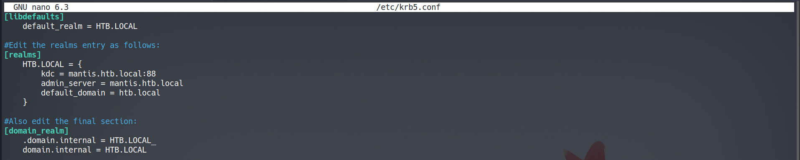

#### Generate James's Ticket

I'll now need a ticket for the James user. I use `rdate` to sync my clock with the domain controller's. Then, I can use `kinit` to create a Kerberos ticket with James's permissions.

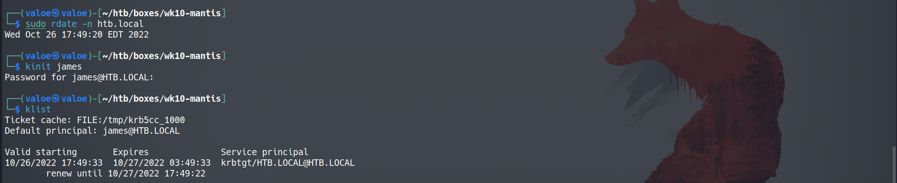

To use the golden ticket exploit, I'll also need James's SID, which I can get from RPC.

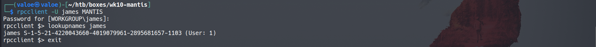

#### Forging the Golden Ticket (MS14-068)

Now the fun begins. I can run the python script linked in the guide to forge a ticket with James's SID.

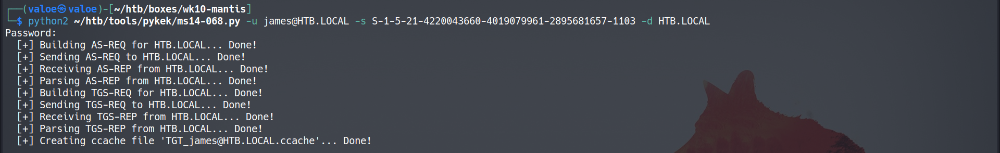

Now, I copy this new ticket over the ticket that was generated by `kinit`. The only thing that may be different for you is the number at the end of the filename, which corresponds to your local user ID (1000 for me).

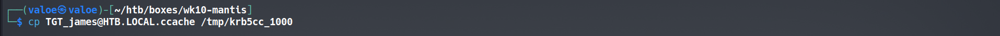

Then, I'll use impacket's `goldenPAC.py` to get a shell with this forged ticket. It comes back administrator, even though James shouldn't be able to do this. Essentially, Kerberos's KDC doesn't properly compare signatures: using *any* checksum type available to it, instead of one of the three types it should require. This allows the python file to "sign" the ticket with MD5 or CRC32 instead of with the Kerberos secret key, which is known only to the Domain Controller. There is a great writeup on this issue [here](https://labs.withsecure.com/publications/digging-into-ms14-068-exploitation-and-defence) if you are interested in the implementation behind this exploit.

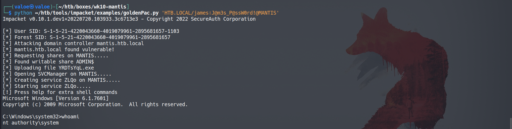

I can grab both user and root flags.

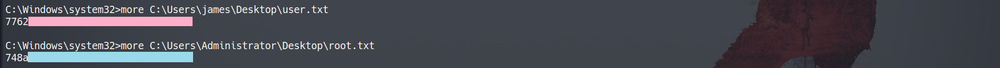

## Recommendations

- Insecure Credential Storage
	- On both the "hidden" webpage and in the MSSQL database, credentials were stored improperly.
	- "Hidden" webpage
		- The credentials for both the Orchard CMS and MSSQL database were stored in a text file. At the very least, this should be moved out of the hosted directory. I would further recommend using a password manager if remembering these passwords proves too difficult to avoid the use of text files in this way.
	- MSSQL database
		- I don't know if James's password working for his system account constitutes password reuse, as I wasn't able to get it to work with MSSQL, but that is something to look into.
		- Either way, James's password should not be stored in plaintext in this database. It should be stored in a hashed format, similarly to the admin password in the same database.
- MS14-068
	- Microsoft has released a patch for this vulnerability and it is my recommendation that this patch is applied.